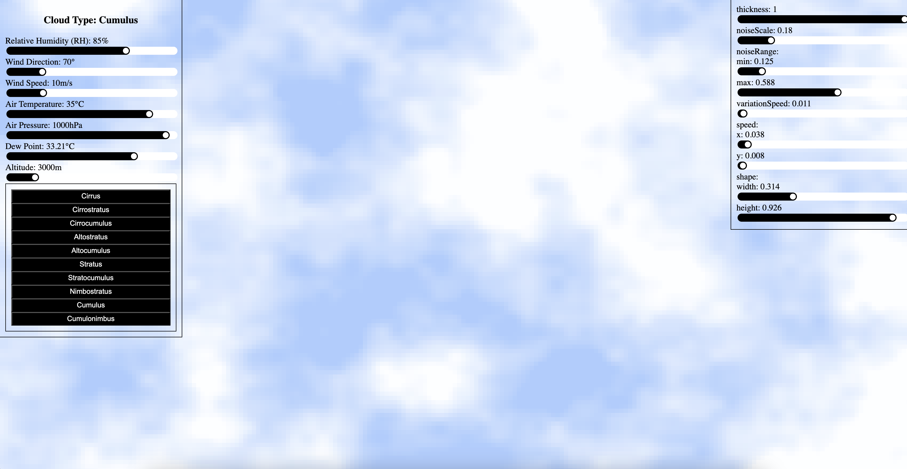

# Cloud Generator

## Overview

This application generates cloud-like formations using Perlin noise with p5.js. Users can modify parameters like wind speed, humidity, altitude, and temperature to see real-time changes in the cloud simulation. 



## Installation

1. Clone the repository:
    
    ```
    git https://github.com/graciegould/cloud-generator
    cd cloud-generator
    ```
    
2. Install dependencies:
    
    ```
    npm install
    ```
    
3. Start the development server:
    
    ```
    npm run dev
    ```
    

## Future Enhancements

- Improved cloud animations
- Additional weather factors (e.g., precipitation, storms, time)
- Integrate weather API

## Author

Developed by Gracie Gould
